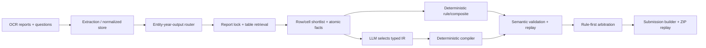

# 01 — Codebase và kiến trúc hiện tại

## Phạm vi rà soát

Rà soát được thực hiện trên `main` tại commit `3a16292f2430bbcc7a2cb52eda39a8bdaa3f4102`, đồng thời đọc diff và chạy test riêng cho hai nhánh remote. Thống kê loại trừ `.orig`, cache và artifact sinh tự động khi tính LOC/AST.

| Khu vực | Python file | LOC xấp xỉ | Function | Class |
|---|---:|---:|---:|---:|
| `vifinqa/` | 66 | 15.966 | 514 | 61 |
| `scripts/` | 43 | 3.539 | — | — |
| `tests/` | 43 | 5.815 | — | — |
| `kaggle/` production runner | 1 | 362 | — | — |

Các module production lớn nhất gồm `selection_v2.py` (1.368 dòng), `devset/p24.py` (1.200), `generate.py` (1.007), `single_cell_consensus.py` (865), `semantic_repair.py` (825) và `shortlist.py` (684). Độ lớn này phản ánh năng lực đã tích lũy, đồng thời chỉ ra nơi cần tách policy khỏi engine.

## Luồng dữ liệu end-to-end

Kiến trúc đúng về nguyên tắc cho bài thi này là `retrieve → ground → plan → compile → execute → verify`. Phần code hiện tại đã có đủ các lớp, nhưng một số lớp tồn tại thành nhiều thế hệ song song và chưa dùng chung một canonical schema.

## Phân tích theo package

### 1. Extraction và store

Các file chính nằm trong `vifinqa/extraction/` và `vifinqa/utils/viet_num.py`.

Điểm tốt:

- Tách HTML table từ OCR và lưu dual store Parquet theo report/table/cell.
- Có one-to-many report index; phân biệt consolidated, separate, aggregated và other.
- Parser số xử lý dấu thập phân tiếng Việt, đơn vị nghìn/triệu/tỷ/trăm tỷ, percent và cổ phiếu.
- Policy `terminal_bare_vnd_v1` xử lý trường hợp sticky unit từ bảng trước làm nhân sai `1e9`; provenance lưu cả scale gốc, scale hiệu lực, nguồn và context hash.
- Store hiện hành đã được kiểm có 1.973 report, 100 table shard, 100 cell shard, 146.246 row và 2.722.031 cell.

Rủi ro:

- Unit policy hiện là heuristic theo context OCR. Nó có test hồi quy tốt nhưng chưa có bộ benchmark độc lập theo loại báo cáo/ngành.
- Store artifact lớn bị ignore; repo source không đủ để tái tạo best checkpoint nếu thiếu corpus, model revision và exact environment.
- Một số correction được áp dụng runtime lên frozen store thay vì rebuild có version. Đây là hợp lý cho ablation, nhưng private release nên tạo store version mới bất biến.

### 2. Router và decomposition

`vifinqa/router/` tách ticker/entity, year, report scope, output type, metric phrase và operation. `decompose.py` dựng fact cross-product cho câu nhiều entity/year và nhận dạng ratio qua các pattern tiếng Việt.

Điểm tốt:

- Entity alias có guard, ưu tiên ticker/target trong ngoặc và xử lý parent-company scope.
- Output contract có `number`, `percent`, `percentage_point`, `ratio`, `year`, `count`.
- Dynamic evidence budget và decomposition đã cải thiện coverage so với baseline đầu.

Rủi ro:

- Decomposition vẫn chủ yếu regex. Các câu `rank(growth(ratio(...)))`, implicit denominator, median partition hoặc điều kiện lồng nhau có thể bị route thành một operation/ticker đơn.
- Router output hiện bị xem như ground truth ở nhiều downstream guard. Fail-closed giúp precision nhưng route sai làm chương trình đúng trở thành bất khả thi.
- Metric/family knowledge bị phân tán giữa router, `atomic_slots.py`, `formulas.py`, P2.4 authoring và nhánh canonical v2.

Kết luận: router nên chỉ tạo một **question graph giả thuyết** gồm entity × period × metric × role, có nhiều candidate plan, thay vì chốt sớm một regex operation duy nhất.

### 3. Retrieval trên `main`

`vifinqa/retrieval/retrieve.py` khóa report theo entity/year rồi dùng BM25 trên table text. Query token gồm metric variants và year; best label match được boost; sau đó áp quota theo report.

`shortlist.py` đi sâu hơn ở row/cell: xây candidate có ticker, year, row, column, value, unit, fact slot và provenance. Nó có strict metric grounding theo token/VAS code/period/entity, fact-aware groups, rescue và tùy chọn BGE-M3 encoder.

Điểm tốt:

- Structured report lock giảm không gian tìm kiếm rất mạnh.
- Lexical BM25 phù hợp với nhãn kế toán exact và mã VAS.
- Shortlist đã có exact cell identity và semantic rejection reason.
- BGE-M3 là optional, không làm pipeline lexical thất bại nếu model không tải được.

Khoảng trống:

- Dense model chỉ tham gia shortlist/row matching; table ranking production vẫn là BM25 + label boost.
- Quota hiện chủ yếu theo report/document, chưa thật sự là per-leaf quota. Một fact dễ có thể chiếm top-k và làm mất denominator/period phụ.
- Chưa có learned cross-encoder/reranker huấn luyện bằng hard negatives như cùng metric sai năm, đúng năm sai entity, same-row wrong column hoặc consolidated/separate conflict.

### 4. Canonical retrieval ở `improve_baseline_kien`

Nhánh này thêm `vifinqa/finance/metrics.py`, `formula_solver.py` và canonical expansion/rerank:

- registry v2 có 139 metric, qualifiers, aliases, codes, statement hints, required/forbidden phrases và component metrics;
- canonical linking tăng từ 534/1.012 lên 791/1.012 câu theo checkpoint ghi trong nhánh;
- retrieval thêm component expansion và row-level score vào BM25;
- synthetic 40 câu tăng execution `0.700 → 0.725`;
- leaderboard được ghi tăng TABLES_F2 `0.4761 → 0.4777` và DOCS_F2 `0.8918 → 0.8945`.

Đây là tín hiệu kiến trúc đáng port nhất. Tuy vậy:

- `formula_solver.py` khoảng 1.641 dòng, chứa nhiều regex và hàm riêng lẻ; không nên trở thành engine thứ hai cạnh typed IR.
- Metric registry được curate thủ công, có thể nhầm qualifier theo ngành và statement.
- Synthetic 40 câu quá nhỏ để chứng minh generalization.
- Artifact `.2866` không có trong Git, nên code + checkpoint Markdown chưa tạo thành một reproduction package hoàn chỉnh.

### 5. Deterministic rule và formula

`rule_codegen.py` giải lookup một ô; `rule_composite.py`, `formulas.py` và `fact_resolver.py` xử lý growth, difference, ratio, ranking và một số family tài chính. Rule được replay và semantic-check trước khi nhận.

Điểm tốt là precision tương đối cao trên P2.4 tune: rule `16/24 = 66,7%`, cao hơn `llm_select 11/46 = 23,9%`. Rule-first arbitration vì vậy là quyết định đúng.

Điểm yếu là formula coverage và argument ordering bị encode phân tán. TAT-QA/FinQA đều cho thấy division, subtraction và change ratio nhạy với thứ tự toán hạng; code hiện có nhiều guard nhưng chưa có một operator registry duy nhất mang type signature, unit algebra và required roles.

### 6. Selection v1 và v2

Selection v1 cho LLM chọn candidate index và operation đơn giản; synthesizer tất định tạo pandas expression. Đây là bước tiến lớn so với LLM viết code tự do.

Selection v2 là phần thiết kế mạnh nhất:

- JSON schema có named facts/bindings và nested IR;
- candidate ref chỉ được phép ở top-level fact;
- kiểm exact schema, type, arity, cycle, node/depth/query limits;
- cấm duplicate stable cell và unused/duplicate semantic fact;
- kiểm entity, year, metric anchor, routed operation và atomic completeness;
- literal phải là identity an toàn hoặc xuất hiện trong câu hỏi;
- unit scale change phải có provenance hợp lệ;
- compiler sinh đúng một expression và compile/replay trước khi accept;
- trace ghi lý do từ chối, raw-response digest, token truncation và unit provenance.

Các operator hiện có bao phủ lookup, arithmetic, ratio, growth, CAGR, percentage-point, conditional/filter, aggregate, count và argmin/argmax projection. Đây là nền tảng nên giữ cho mọi candidate private.

Hạn chế chính không còn là compiler mà là **planner/grounding đầu vào**. Các session schema 7/8 cho thấy nhiều shortlist được gọi là complete theo ticker/year nhưng sai metric. Khi semantic gate được siết, chỉ 2 Stage-B và 4 Stage-C câu còn complete. Điều này là bằng chứng tốt rằng nới compiler hoặc sampling thêm không giải quyết retrieval/fact linking.

### 7. Runner và arbitration

`generate.py` có crash-safe baseline-first design:

- ghi rule baseline đủ 1.012 ID trước GPU;
- chunk/checkpoint và atomic replace;
- exact run signature khi resume;
- OOM backoff và sequential sample fallback;
- time budget;
- trace mọi accepted/rejected attempt;
- rule-first arbitration.

Thiết kế này phù hợp Kaggle T4 và đã giải quyết lỗi runner cũ gọi `1012 prompts` trong một batch. Một chi tiết cần cải thiện: confidence hiện vẫn gồm nhiều threshold/score heuristic và không calibrated trên OOD folds. Private gating cần dựa trên out-of-fold correctness probability, không dựa vào public score hoặc raw BM25 scale.

### 8. Raw-code executor

`vifinqa/codegen/executor.py` dùng lexical denylist, namespace rỗng builtins và `eval/exec`; trên POSIX có signal timeout, trên Windows chạy inline. Đây **không phải security sandbox**: pandas/numpy vẫn là object giàu capability và denylist chuỗi không thể chứng minh an toàn. Nó cũng làm bề mặt chương trình lớn hơn typed IR.

Đối với private round, nên vô hiệu hóa raw-code mode và chỉ cho chạy expression do compiler tất định sinh ra. Nếu vẫn giữ cho nghiên cứu, hãy dùng AST allowlist + process isolation, resource limit và read-only filesystem.

### 9. Semantic, replay và submission

`semantic.py`, `to_expression.py` và `submission/build.py` là lớp correctness tốt:

- dataflow/AST check để loại constant hallucination và dead DataFrame;
- một-expression contract theo grader;
- duplicate/missing ID, non-finite answer và evidence mismatch đều fail;
- tự đóng gói exact CSV referenced;
- kiểm ZIP layout;
- replay toàn bộ query trên chính CSV sẽ nộp.

Việc Answer Accuracy luôn bằng Execution Accuracy ở các mốc gần đây cho thấy lớp compile/replay không tạo execution gap quan sát được. Đây là thành tựu thật, nhưng không đồng nghĩa semantic answer đúng.

### 10. P2.4 devset

P2.4 human gold 100 câu có exact cell, typed AST, 578 evidence references và forensic validation. Nó phát hiện đúng lỗi metadata column và unit/period. Baseline cho thấy 83/100 executable nhưng chỉ 32 đúng; 51 câu chạy được nhưng sai. Non-single chỉ đúng 10/61; percent/pp/ratio/count chỉ 1/27.

Đây là bằng chứng mạnh rằng trọng tâm phải là fact selection, type/unit và nested semantics. Song vì 100 câu được sample từ official 1.012 questions, từ nay không dùng nó để chọn candidate private nếu mục tiêu là tránh public bias.

Auto-silver 377 report-pairs có accepted precision 1.0 trên tune/locked theo task một-cell. Nó hữu ích cho cell/period/unit resolver nhưng không đại diện QA đa bước hay leaderboard accuracy.

### 11. Scripts, tests, notebooks và tài liệu

`scripts/01` đến `56` tạo một runbook thực thi khá chi tiết, nhưng nhiều script cuối là overlay exact-ID. Nên phân loại lại thành:

- reusable pipeline commands;
- experiment-only ablations;
- retired/historical scripts;
- private production commands.

43 test file và 301 test trên `main` là coverage tốt cho regression. Khoảng trống vận hành là không có GitHub Actions, không có dependency lock và chưa test matrix theo Python/Pandas/PyArrow version.

20 file `.orig` đang được track, dù payload builder đã loại chúng. Chúng làm review/diff nhiễu và có nguy cơ drift; nên chuyển lịch sử về Git và xóa `.orig` khỏi source tree trong một commit riêng.

Notebook Kaggle có guard payload/run signature tốt. Nhánh `tranhuy` chủ yếu thêm OpenAI-compatible model server; đây là hạ tầng thử nghiệm, không cải thiện thuật toán QA và không nên ưu tiên trước private candidate correctness.

## Phân tích nhánh và chiến lược tích hợp

| Nhánh | Vai trò | Giữ | Không nên làm |
|---|---|---|---|
| `main` | correctness, typed IR, P2.4, submission guards | làm nền tảng | tiếp tục exact-ID overlay |
| `improve_baseline_kien` | canonical ontology/retrieval/formula | port registry + rerank + tests | merge nguyên nhánh; dùng `.2866` như proof generalization |
| `tranhuy` | model serving | giữ tùy chọn cho batch experiments | xem như candidate algorithm |

Diff `main...improve_baseline_kien` gồm 168 file, khoảng 5.542 dòng thêm và 29.862 dòng xóa; nhánh cải tiến chỉ có 93 tracked file so với 201 trên `main`. Vì thế merge nguyên nhánh sẽ làm mất các lớp mới hơn. Port nên theo thứ tự dependency: schema → canonicalizer → retrieval features → formula operators → tests → ablation.

## Findings ưu tiên

### P0 — phải xử lý trước khi khóa private

1. **Không thể tái lập best checkpoint từ repo:** artifact `.2866` absent; cần regenerate hoặc phát hành artifact manifest/content-addressed bundle.
2. **Public-ID policy trong production:** exact allowlist phải bị cấm ở private config và CI guard.
3. **Mẫu số leaderboard chưa thống nhất:** `main` dùng 506, checkpoint nhánh dùng 1.012; không quy đổi score thành số câu trước khi BTC/dashboard xác nhận.
4. **Model eligibility chưa khóa:** 14.7B total so với rule `<= ~14B`.
5. **Raw LLM code path không phải sandbox:** không dùng trong private artifacts.

### P1 — cải thiện xác suất generalization

1. Hợp nhất canonical metric/qualifier/component schema.
2. Per-leaf retrieval với hard negatives và OOD evaluation.
3. Một typed operator/formula registry duy nhất.
4. Calibration theo group-held-out folds và worst-fold guard.
5. Pre-register năm candidate trước private score.

### P2 — engineering hygiene

1. Thêm CI, dependency lock, environment image và exact model revision.
2. Xóa `.orig`, phân loại retired scripts và giảm module monolith.
3. Thêm repo license/NOTICE và provenance cho external/open data.
4. Tạo experiment registry có source hash, artifact hash, data split hash và evidence tier.
